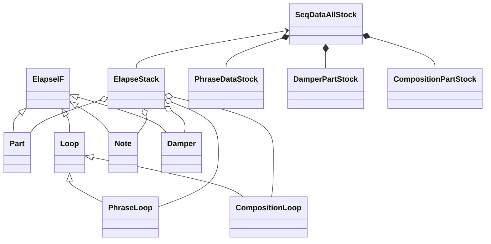

# Loopian developping memo

## what's this

- text command による loop sequencer
- 音色はピアノを想定し、ミニマルな音楽を指向する
- command は一行単位で入力
- 移動ド(d,r,m..)による階名指定
- コード(I,II..)指定で、入力に変化を与えながらループ再生
- 自動にピアノの表現を付加
- BPM, Key, 拍子(Beat)などの基本的な音楽指示が可能

## what you can do

- Live Coding
- Musical Education
- Loop Sequencer
- Dynamic Easy Listening
- Interactive Art(with Device)

## Spec.
### piano 専用 Realtime Loop Generator (Text Sequencer)

- Input Part は4つ
    - L(L1), L2, R(R1), R2
- Pedal 用隠しパートが一つ
- MIDI ch. は一つ

### 出力 MIDI

- Note On/Off
- Sustain CC#64
- Reverb Depth CC#91
- Volume CC#7

### テキスト入力

- ユーザーは、Phrase入力（ [] で入力）と、Composition入力（{}で入力）の二つの入力ができる
- Phrase入力の考え方
    - User は、ノート番号とタイミング、簡易な表情指示(Music Expression)を入力
    - exp.engine は、簡易な表情指示からベロシティ、微妙なタイミング、dulation、ペダル情報を自動生成
- Composition入力と、自動和音変換
    - Composition で指定された和音に従って、Phrase 入力の音は自動変換される
    - Composition も、各パートごとに設定する
    - 全体に同じ Composition を適用したい場合、全パート入力モードにする
- 各パートの Phrase も、Composition も、それぞれ独自の周期で loop する
- Phrase入力 Music Expression 一覧
    - ff,f,mf,mp,p,pp,ppp  （ベロシティ指定）
    - ped, noped （ペダル奏法）
    - artic: stacc,legato,marc （dulation指定）
    - p->f など音量の漸次的変化
- Composition入力 Music Expression 一覧
    - para  （コード変換の指定）

## Design

### Elapse Object

- 用語定義
    - Elapse Object: 時間経過をもつオブジェクト
    - ElapseIF Class: Elapse Object の最上位の抽象クラス、ほぼIF
    - Elapse Stack Class: 全ての Elapse Object を集約し、周期に従いコールする処理を行う

- 再生されるデータは全て Elapse Object の継承 Object が出力
    - Elapse Object は全て ElapseIF Class から継承される
    - 以下の Class が継承されている
        - Part Class
        - Loop Class(Phrase/Composition)
        - Note/Pedal Class

- Elapse Object は、Elapse Stack Class(EST) で管理される
    - EST は Elapse Object をリストに繋げる
    - periodic() で各 Elapse Object の periodic() をコールする
        - 各 Elapse Object は、next_tick, next_msr で次回に呼ばれるタイミングを返す
        - next_tick/next_msr の値に準じて、EST は順序通りに Elapse Object をコール

### 自動変換

- Noteデータは以下の過程で内容を書き換えられていく
    1. [raw/生] ユーザーが入力した生データ
    1. [complement/補填] 生データに足りないデータを補填したり、追加フレーズを繋げたデータ
    1. [recombined/再構成] SMF 的な、tick/note/velocity をセットにしたデータ
    1. [analyzed/分析] コード変換時に自然な変換をするための分析データ
    1. [humanized/生演奏] velocity/duration を生演奏に近づけたデータ
    1. [randomized/乱数] random要素を加味したデータ
    1. [translated/変換] コードの反映
- 上記のうち最初の５つは、ユーザーによる入力時に処理される(static)
    - 小節冒頭にこのデータが Loop Obj.にロードされる
- 再生中、リアルタイムに最後の二つの処理が行われる(dynamic)
- 上記の各データが、他の要因で変更されるタイミングは以下
    - phrase が入力されたら、最初からやり直し(set_raw())
    - composition が入力されたら、「再構成」からやり直し(set_recombined())
    - bpm/beat/key が変わったら、「再構成」からやり直し
    - 再生中に Loop がひとまわりするたびに「乱数」からやり直し(get_final())
- 実際の MIDI 出力はさらに、バッファに積まれ、latency の時間の後に出力される

- Pedalデータは各パートの Loop 冒頭に以下の処理を行う
    - コード情報があれば、ペダルを踏む
    - コード情報がない、あるいは noped 指定の場合はペダルを踏まない

### Filter

- [raw] を指定しない限り、勝手に exp.engine によるフィルタがかけられる
- Humanization Filter
    - 強拍/弱拍(linear) -> velocity [実装済み]
        - bpm が高いほど強調(bpm:72-180)
    - 時間間隔(Non-linear) -> velocity/duration
        - Note OffとNote Onの間隔は、短い音符になるほど、時間一定になりやすい
        - 細かい音符は大きな velocity で弾くことは困難(limit)
    - 未来密度、過去密度(linear) -> velocity/duration
        - 密度：現在より２拍以内（未満ではない）にある音符×距離の総和
        - 過去密度が高く、未来密度が低い場合、フレーズの終わりとみなし、velocity/duration は減らす
        - 過去密度が低く、未来密度が高い場合、フレーズの開始とみなし、volocity をちょっと減らす
        - 両密度とも高いとき、少し強め
    - 音高平均との差(linear) -> velocity
        - フレーズの平均音高より離れていると、velocity は強くなる
- Translation Filter
    - Common
        - テーブルを通した一番近い音に変更
    - Arpeggio
        - 連続して同じ音が出ない
        - 四分音符未満の長さに適用
    - Parallel
        - 音程全体を、ルート音の音高分だけ平行移動する

### 次にやること
- アルペジオで連続して同じ音が出ないようにする -> 同音回避型和音変換対応　済
- ベロシティが、周期的に変わる謎の現象 -> copy されていなかった不具合修正　済
- | を小節区切り対応、 ,, 連続で同じものを補填する対応　済
- 左手用に、平行移動型の和音変換、Music Expressionへの追加(trans:para/parallel)　済
- Composition を４つのパート独立に設定できる　済
- 音価指定を階名の[]の中に組み入れる、音価用の[]をやめる　済
- 各パートのイベントのタイミングを合わせる大幅な修正　済
- Pedal On/Off の Music Expressionへの追加(noped)　済
- ',",q,hによる冒頭の音価設定　済

当面の対応
- なし

先の話
- rit. -> Fine
- 現在のループをひとまとめで取っておき、簡単な指示で呼び出し可能とする
- さらなる humanized アルゴリズムの追加
- Load/Save機能、Auto Load機能

## loopian 計画
- loopian を使った動画制作
- loopian::device によるリアルタイム演奏
- rust に書き換える

### 動画作成
- QuickTime Player で新規画面収録
- 単体: 画面サイズ 896 * 504
  Pianoteq8付きサイズ 1600 * 900
- オーディオ出力 : 複数出力装置（BlackHole & xxxのスピーカー）
    - DAWの出力も確認
- 録音設定 : オプションから BlackHole 2ch を選択
- Audio MIDI -> オーディオ装置 -> 「複数出力装置」選択 -> マスター装置: BlackHole 2ch
- iMovieに入れるが、YouTubeではなく、ファイル出力指定にする(1080p 60)
- 紹介文
Live Coding by Loopian & Pianoteq8

Loopian is a real-time loop sequencer that describes notes by text.
It is designed to be played primarily in Piano tones.
Usages:
    - Generating music by entering text in real-time in the style of Live Coding
    - Loop-based phrase transformations in real-time for performance, interactive art, etc.
    - Solmization practice in music education with movable-do

Loopian は、テキストで音符を指定するリアルタイムループシーケンサです。
主に Piano 音色で演奏されることを前提に開発しています。
使用用途：
    - Live Coding 風にリアルタイムにテキストを入力して音楽を生成
    - ループベースのフレーズをリアルタイムに変容させるパフォーマンス、インタラクティブアートなどへの応用
    - 音楽教育における、移動ドによるソルミゼーション実践

#livecoding  #midi  #piano  #python  #pianoteq
