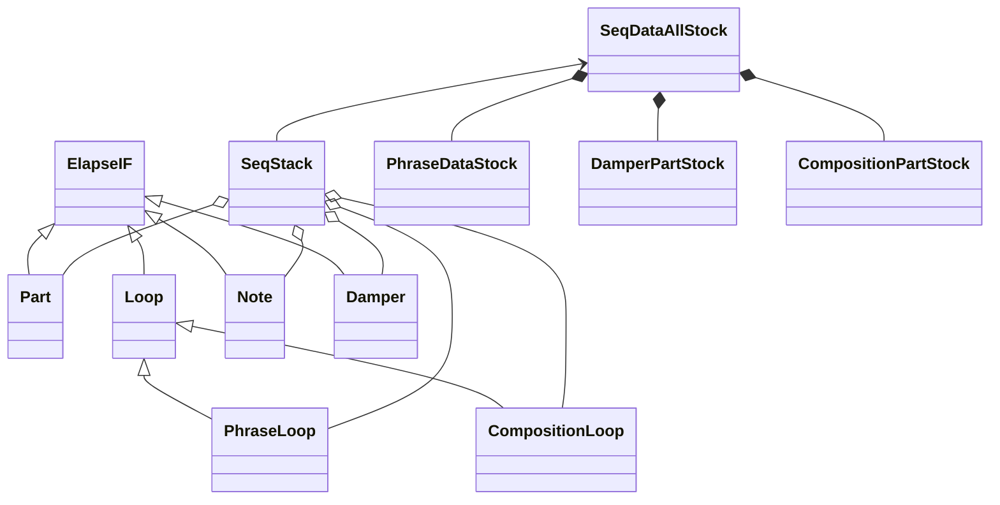

Loopian developping memo

- what's this
    - text command による loop sequencer
    - 音色はピアノを想定し、ミニマルな音楽を指向する
    - command は一行単位で入力
    - 移動ド(d,r,m..)による階名指定
    - コード(I,II..)指定で、入力に変化を与えながらループ再生
    - 自動にピアノの表現を付加
    - BPM, Key などの基本的な音楽指示が可能

- piano 専用 Realtime Loop Generator (Text Sequencer)
    - Input Part は4つ
        - L(L1), L2, R(R1), R2
    - Pedal 用隠しパートが一つ
    - MIDI ch. は一つ
- 出力 MIDI
    - Note On/Off
    - Sustain CC#64
    - Reverb Depth CC#91
    - Volume CC#7
- テキスト入力
    - ユーザーは、Phrase入力（ [] で入力）と、Composition入力（ {}で入力）の二つの入力ができる
    - Phrase入力の考え方
        - User は、ノート番号とタイミング、簡易な表情指示を入力
        - exp.engine はベロシティ、微妙なタイミング、dulation、ペダル情報を自動生成
    - 入力 Music Expression 一覧
        - KeyEvent: Note On Timing, Note Number, Expression
        - Expression: raw, ff,f,mf,mp,p,pp, dolce, stac./staccato, legato, marc./marcato etc.
    - 各パートの Phrase も、Composition もそれぞれ独自の周期で loop する
- Filter
    - [raw] を指定しない限り、勝手に exp.engine によるフィルタがかけられる
    - フィルタ種類
        - 強拍/弱拍(linear) -> velocity [実装済み]
            - bpm が高いほど強調(bpm:72-180)
        - 時間間隔(Non-linear) -> velocity/duration
            - Note OffとNote Onの間隔は、短い音符になるほど、時間一定になりやすい
            - 細かい音符は大きな velocity で弾くことは困難(limit)
        - 未来密度、過去密度(linear) -> velocity/duration
            - 密度：現在より２拍以内（未満ではない）にある音符×距離の総和
            - 過去密度が高く、未来密度が低い場合、フレーズの終わりとみなし、velocity/duration は減らす
            - 過去密度が低く、未来密度が高い場合、フレーズの開始とみなし、volocity をちょっと減らす
            - 両密度とも高いとき、少し強め
        - 音高平均との差(linear) -> velocity
            - フレーズの平均音高より離れていると、velocity は強くなる

- 設計
    - データは以下の過程で内容を書き換えられていく
        1. ユーザーが入力した生データ(生/raw)
        1. 生データに足りないデータを補填したデータ(補填/complement)
        1. SMF 的な、tick/note/velocity をセットにしたデータ(recombined)
        1. コード変換時に自然な変換をするための分析データ(analyzed)
        1. velocity/duration を自然にしたデータ(自然/humanized)
        1. random要素を加味したデータ(乱数/randomized)
        1. 構成データの反映(構成/Composed)
        - 上記のうち、最初の５つはユーザーによる入力時に行う処理
        - 小節冒頭にこのデータが Loop Obj.にロードされる
        - 再生時、リアルタイムに最後の二つの処理が行われる
    - 上記の各データが、他の要因で変更されるタイミング
        - bpm が変わったら、「生成」からやり直し
        - beat/key が変わったら、「補填」からやり直し
        - 再生で Loop がひとまわりするたびに「乱数」からやり直し
        - phrase が入力されたら、最初からやり直し
        - composition が入力されたら、「構成」からやり直し
    - 実際の MIDI 出力はさらに、バッファに積まれ、latency の時間の後に出力される

- 次にやること
    - アルペジオで連続して同じ音が出ないようにする
        - オリジナル(thru)が同じ音でなければ、和音展開した音も同じ音にしない -> 本当にやるか？
    - さらなる humanized アルゴリズムの追加
    - ベロシティが、周期的に変わる謎の現象？？？

- loopian 計画
    - loopian を使った動画制作
    - loopian::device によるリアルタイム演奏
    - GUI/MIDI以外を rust に書き換える
